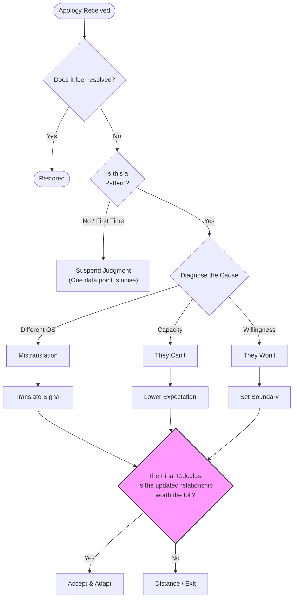

_And What You're Actually Evaluating When That Happens_

---

Someone says "I'm sorry," and instead of feeling better, you feel… **off.**

Not angrier.  
Not more hurt.  
Just _unconvinced_—like a box was checked, but not _your_ box.

Most people recognize this feeling immediately. Fewer can explain it.  
And almost everyone has, at some point, been told: _"They apologized—what more do you want?"_

That question turns out to be doing a lot of hidden work.

---

> ##### **TL;DR**
>
> _When an apology feels empty, it's usually because it answered a different question than the one you were asking._
> {: .block-tip }

---

## What Your Brain Is Actually Asking

On the surface, it sounds like people are judging sincerity. _Did they mean it? Was it genuine?_

But if you watch your own reactions carefully, that's rarely what determines how an apology lands.

What's actually happening is closer to this:

> _Given this apology, what am I supposed to believe now?_

Believe about whether they understand the harm.
Whether this is likely to happen again.
Whether the relationship feels stable or fragile.

In other words, apologies aren't just moral gestures (or attempts to get you to stop looking at them like that).

They're **informational signals**—probability estimates about future behavior. People use them, quietly and intuitively, to update expectations about what comes next.

This isn't cynicism.  
It's **prediction.**

Think of an apology like a weather forecast.

"I'm sorry" doesn't mean "it will never rain again." It means "based on current conditions, there's a reasonable chance I understand what went wrong." Some apologies say _40% chance of understanding, clearing by tomorrow._ Others say _I didn't see it before, but now I do—expect different conditions ahead._

Neither is a guarantee.  
But **one gives you more to work with.**

---

> ##### **TL;DR**
>
> _You're not grading apologies on politeness. You're using them to predict what happens next._
> {: .block-tip }

---

## The Part We Rarely Say Out Loud: Apologies Do Different Jobs

One reason this gets messy is that people don't actually agree on what an apology is _for_.

There are at least two models in play.

### The Signal Model

In this model, an apology exists to mark a boundary. It says: _I acknowledge something went wrong. I recognize the norm. We can close this now._

This kind of apology is efficient. It keeps social systems running. It prevents every small rupture from turning into a postmortem.

It also quietly ends a lot of conversations.

And often, that's exactly what should happen.

Not every rupture needs a postmortem. Not every misstep requires excavation. Signal apologies are the social immune system—they handle the routine infections so the body can function. Without them, every relationship would collapse under the weight of its own processing.

The problem isn't Signal apologies. It's when they're the _only_ tool in the kit.

### The Process Model

In this model, an apology is expected to reflect internal change. It says: _I understand something I didn't before. My interpretation has updated. That update should show up later._

This model prioritizes recalibration over closure.

Both models are coherent.  
Both are common.  
Both use the same word: _sorry_.

This is… **inconvenient.** (Or catastrophic, depending on your anxiety levels.)

To see why, consider what an apology is technically supposed to do. Most frameworks break it into four components:

    

        
    

| Component                 | What It Says                                | Signal Apology | Process Apology |
| :------------------------ | :------------------------------------------ | :------------: | :-------------: |
| **Acknowledge**           | "Something I did affected you negatively."  |       ✓        |        ✓        |
| **Accept Responsibility** | "I did it. Not the weather. Not your tone." |       ✓        |        ✓        |
| **Express Remorse**       | "I feel bad about that impact."             |       ~        |        ✓        |
| **Commit to Change**      | "Future behavior should differ."            |       ~        |        ✓        |

Signal apologies tend to hit (1) and (2)—enough to mark the transaction complete. (The relational equivalent of marking an email as 'read'.) Process apologies are expected to deliver all four, with (3) and (4) doing the heavy lifting.

Think of it like legal settlements. They don't prove moral enlightenment; they stop the bleeding. Signal apologies work the same way. That's not a bug—it's a coordination feature. But it optimizes for social stability, not relational depth.

---

> ##### **TL;DR**
>
> _People often give the apology they believe is appropriate, not the one the other person is evaluating._
> {: .block-tip }

---

## A Simple Example That Gets Complicated Fast

Imagine this:

Jamie makes a joke at a group dinner. It lands badly—not maliciously, but it stings. Later, they say: _"Hey, sorry about earlier."_

That response might feel sufficient.  
Or dismissive.  
Or oddly hollow.

Now add context.

It's not the first time. Jamie apologizes quickly—always. They don't like revisiting things once they've been addressed. But they're otherwise supportive, reliable, the person who shows up when it matters.

At this point, the apology stops being a single event.
It becomes part of a pattern.

And patterns carry far more information than words.

One apology is weak evidence. Your brain knows this, even when you wish it didn't. What actually moves your inference is _repeated behavior_—apologies that expand over time, or ones that stay shallow no matter the stakes.

Now flip it.

Imagine you're on the other side of the table. You said something careless. You know it. You apologize—quickly, because that's how you show you care. You don't want this to fester.

But instead of landing, your apology opens a door you didn't expect. Now there are questions. Follow-ups. A request to "talk about what happened." You're being asked to narrate your internal state, reconstruct your intent, and demonstrate understanding—on demand, in real time.

You already felt bad.  
Now you feel **interrogated.**

This is the **reverse Jamie problem.** And it's just as real.

Some people experience process-level repair not as care, but as an emotional audit they can never quite pass. The goalpost isn't visible. The "right" answer keeps shifting. The conversation doesn't feel like connection—it feels like a test with no answer key.

That exhaustion isn't avoidance.  
It's its own kind of **hurt.**

---

> ##### **TL;DR**
>
> _One apology is a data point. A pattern is a signal._
> {: .block-tip }

---

## Why Closeness Makes This Harder, Not Easier

There's a common assumption that closer relationships naturally default to deeper apologies.

Intuitively, it makes sense—more investment, more care, more willingness to go further.

In practice, closeness mainly does one thing: **it raises the cost of being wrong.**

A shallow apology from a stranger is forgettable.
The same apology from someone close feels _diagnostic_—like it's telling you something you didn't want to know.

That's because intimacy doesn't increase certainty.  
It increases **stakes.**  
_(Thanks, evolution.)_

This is where many people misfire. They interpret a mismatch in apology depth as a lack of care, when it's often a mismatch in _optimization strategy_.

Some people optimize for minimizing conflict duration—restoring equilibrium quickly, preventing escalation. Others optimize for shared understanding—reduced future risk, internal alignment.

Same interaction.  
**Different goals.**

Here's the part that's easy to miss: some people genuinely believe _conflict itself is the wound_—so ending it fast _is_ the care. For them, a drawn-out process apology doesn't feel connective. It feels like reopening something that should be healing.

That doesn't mean they're right. It means their optimization function isn't broken—it's just pointing somewhere else.

Back to Jamie.

Jamie's consistent, quick apologies might mean: _I care and want this resolved so we can move forward._ Or they might mean: _This pattern works well enough—why change it?_

You can't tell from one instance.

But you can tell from **twenty.**

A rough heuristic: one data point—suspend judgment. Two aligned data points—update gently. Three aligned data points across different contexts? Treat that as a stable parameter, not noise.

---

> ##### **TL;DR**
>
> _Closeness doesn't guarantee depth—it just makes mismatches more consequential._
> {: .block-tip }

---

## The Parts People Miss

Up to now, this sounds pretty charitable. That's intentional—but incomplete. There are three complications most advice skips.

### 1. Strategy Exists

> ##### WARNING
>
> Not all shallow apologies are preference-driven or model-mismatched. Some are **strategic**.
> {: .block-warning }

That doesn't mean malicious.
It means responsive to incentives.

If shallow apologies reliably reset the situation—end the conversation, restore access, avoid consequences—then shallow apologies are _efficient_. Over time, repeated signal-only apologies aren't confusion.

**They're data.**

Ignoring this leads to overly generous interpretations that don't match reality.

### 2. Capacity vs. Willingness Look Identical

Another place people get stuck: collapsing "they _can't_" and "they _won't_."

From the outside, these look the same—discomfort with follow-up, vague wording, pressure to move on.

But the implications are different.

Capacity limits suggest you might need to adjust expectations.
Willingness limits suggest you might need to make a boundary decision.

There's also a third possibility worth naming: they _can_ go deeper but believe they _shouldn't_. Some people avoid process-level apologies because claiming full understanding feels dishonest to them. They're not withholding—they're being epistemically humble about the limits of knowing another person's experience.

This can produce apologies that sound dismissive ("I'm sorry you felt that way") but aren't actually indifferent. The restraint is the point.

And here's the part nobody wants to admit: **process apologies are expensive.**

Not in a "this is hard" way—in an actual resource-depletion way. They require emotional bandwidth, cognitive load, vulnerability, and time. They're the full cardiovascular workout of interpersonal repair.

Signal apologies are a brisk walk to the fridge.

Neither is wrong.

But if you're expecting someone to do the full workout for every minor friction, you're going to run out of relationship before you run out of conflicts.

This is where **frequency** quietly becomes the variable everyone ignores.

If you have two serious conflicts a year, process apologies are sustainable. If you have fifty small frictions, demanding process-level repair each time is a recipe for mutual exhaustion. At some point, the math doesn't work—not because anyone stopped caring, but because humans have finite metabolic reserves for emotional deep-dives.

The failure mode isn't "they won't do the work."

Sometimes it's "the work exceeds the available supply of work."

(This is also why some people seem to have infinite patience for repair in new relationships and none in long ones. The account got overdrawn. Interest compounded.)

You don't have to diagnose which is which immediately. You do have to notice which one you keep _assuming_.

There's a shadow version of this worth naming: **process apologies can be their own kind of avoidance.**

Not always. But sometimes.

Insisting on deep processing after every friction can function as a control mechanism—keeping the other person in a permanent state of emotional accountability. "We need to talk about this" can be genuine repair. It can also be a way of never letting something be _finished_.

The person demanding depth isn't always seeking understanding.
Sometimes they're seeking reassurance that can't be permanently given.
Sometimes the processing _is_ the problem—not because they're wrong to want it, but because no amount of it will ever feel like enough.

If signal apologies can be strategic, process apologies can be compulsive.

Both failure modes exist.
Most advice only names one.

### 3. Power Changes the Math

> ##### DANGER
>
> All of this becomes more complicated when **risks aren't equal**.
> {: .block-danger }

Consider: an employee raising a concern with a manager. A partner who's more emotionally invested than the other. A friend who needs the relationship more.

In unequal dynamics, signal apologies often function as containment tools—not maliciously, but structurally. The person with less power may not be able to safely push for clarity, even when they need it.

The framework still applies. But inference happens under unequal risk, and "just communicate better" advice tends to collapse here.

Jamie, it turns out, sets the emotional pace in most of your interactions.
(You've probably noticed this already. It's why you're reading this article.)

You're often the one adapting.

That doesn't mean they don't care.
It does mean the cost of pressing for more falls disproportionately on you.

---

> ##### **TL;DR**
>
> _Strategy, capacity, and power all shape what apologies mean—and what's safe to ask for._
> {: .block-tip }

---

## The Reframe That Actually Helps

Here's the shift that makes this framework practical instead of just interesting:

**An apology isn't a verdict. It's a data point.**

It doesn't answer: _Do they care?_

It updates: _How likely is it that they understand in the way that matters here?_

And here's the quieter update that often hurts more:

> _How likely is it that we're even playing the same game?_

Your discomfort after a hollow apology often isn't about the apology itself.

It's your estimate of shared relational assumptions drifting downward.

That's a different kind of loss.

Once you see that, a few things shift:

- Discomfort after an apology often signals insufficient information, not ingratitude
- The question changes from "Did they mean it?" to "What does the pattern suggest?"
- Your unease might be tracking something real—a growing sense that you're not playing the same game

This doesn't mean turning every apology into an audit. Interpretation itself has a cost. There's a failure mode where you never let anything settle, treating every word as evidence to be weighed. That's not insight—it's anxiety with spreadsheets. (I have personally filed these spreadsheets. They are not helpful.)

The goal isn't maximum analysis.

It's **accurate inference, over time.**

---

> ##### **TL;DR**
>
> _Apologies are forecasts, not guarantees. Treat them accordingly._
> {: .block-tip }

---

## The Part Where Psychology Gets Uncomfortably Relevant

If the reframe above clicked, this next part will explain why it's so hard to actually apply.

If you've been nodding along thinking "this explains that one person," congratulations: you've arrived at the attachment theory portion of our program.

(Don't worry. We're not turning this into astrology. Unless you're a Gemini. Just kidding. Brief detour, then back to earth.)

People don't enter conflicts neutrally. They bring priors—not just about this argument, but about what conflict _means_.

Some people grew up learning: _closeness is fragile. If I don't get confirmation that we're okay, we might not be okay. Ambiguity is dangerous._

Others learned: _conflict is engulfment. The longer this goes, the more I lose myself. Distance is safety._

These aren't conscious beliefs. They're the background operating system that processes apologies before the words even land.

So the same apology—same words, same tone, same timing—can feel:

- Like abandonment to one person ("They didn't go deep enough; do they even care?")
- Like a reasonable close to another ("I acknowledged it; why are we still here?")

Neither is imagining things.
They're just running different firmware.

This is annoying, because it means the question "Was that apology good enough?" doesn't have a context-free answer. It depends on what each person's nervous system is scanning for.

Jamie's quick apologies might genuinely feel complete to Jamie—not because Jamie doesn't care, but because Jamie's system registers "conflict acknowledged, threat neutralized, return to baseline." Meanwhile, your system is still running: "But did they _understand_? Is it _safe_ now?"

**Two different threat models.**  
**Same room.**

And here's what gets lost in most writing about this (including, until this paragraph, this one): Jamie's experience of that mismatch isn't neutral either.

If your system reads their quick apology as abandonment, their system may read your need for processing as an escalation threat. You feel uncared for. They feel unsafe. You're both scanning for danger—just in opposite directions.

The person who closes quickly isn't always fleeing.  
Sometimes they're **protecting**—themselves, the relationship, the fragile peace they've worked to build.

That protection can look like indifference from the outside.  
From the inside, it often feels like **survival.**

This doesn't make mismatches less painful. It makes them more symmetrical than they appear.

The practical upshot: if you keep having the same fight about apologies, you might not be disagreeing about words. You might be disagreeing about what repair _is_.

That's harder to fix.  
Also **more useful to know.**

---

## The Error Tradeoff Most People Never Name

Underneath all of this is a tradeoff people rarely articulate—and it maps directly onto those different firmware versions.

What I eventually realized was going on in my head, even before I could name it:

I was afraid of believing Jamie understood when Jamie didn't.

That's one kind of mistake.

Some people are most afraid of **believing someone understands when they don't.**

Others are most afraid of **missing real care because it didn't arrive in the expected form.**

In statistics, these are called false positives and false negatives.
In relationships, they're called _resentment_ and _loneliness_.

| Error Type         | In Your Relationship                      | The Regret                   |
| :----------------- | :---------------------------------------- | :--------------------------- |
| **False Positive** | Believing they understand when they don't | Resentment (stayed too long) |
| **False Negative** | Missing real care in unexpected form      | Loneliness (left too early)  |

Neither mistake is irrational.
They just optimize for different regrets.

The question worth asking isn't _"Who's right about the apology?"_

It's:

> _Which error am I more likely to regret here?_

That doesn't give you an answer.

But it gives you a better question—one that's actually about your situation, not about apologies in the abstract.

---

> ##### **TL;DR**
>
> _You're not choosing between trust and boundaries. You're choosing which mistake you can live with._
> {: .block-tip }



### The Core Question

When someone apologizes, you're implicitly asking: _"Given what I just observed, how likely is it that they actually understand?"_

Let's call this $$P(U \mid A)$$—the probability of genuine **U**nderstanding given the **A**pology you observed.

### Building the Model

**Step 1: The Basic Update**

Bayes' theorem tells us how to update beliefs given new evidence:

$$
P(U \mid A) = \frac{P(A \mid U) \cdot P(U)}{P(A)}
$$

In plain English:

- $$P(U)$$ = Your **prior belief** they understand (before this apology)
- $$P(A \mid U)$$ = How likely is this apology _if_ they truly understand?
- $$P(A \mid \neg U)$$ = How likely is this apology _if_ they don't understand?
- $$P(A)$$ = How likely is this apology in general?

**Step 2: Why Words Alone Are Weak Evidence**

The key insight is the **likelihood ratio**:

$$
\text{LR} = \frac{P(A \mid U)}{P(A \mid \neg U)}
$$

If someone can easily say "I'm sorry" whether or not they understand, then $$P(A \mid U) \approx P(A \mid \neg U)$$, and $$\text{LR} \approx 1$$.

A likelihood ratio of 1 means: _this evidence doesn't move your beliefs at all._

| Evidence Type               | Likelihood Ratio | Belief Update |
| :-------------------------- | :--------------: | :------------ |
| Formulaic "I'm sorry"       |       ~1.0       | Almost none   |
| Accurate paraphrase of harm |       ~3-5       | Moderate      |
| Behavior change weeks later |       ~10+       | Strong        |
| Unprompted follow-up        |      ~5-10       | Strong        |

### Adding Complexity: The Full Model

The article discussed several factors. Let's formalize them.

**Factor 1: Apology Type**

Let $$T \in \{\text{Signal}, \text{Process}\}$$ represent the apology type. We actually care about:

$$
P(U \mid A, T) = \frac{P(A \mid U, T) \cdot P(U \mid T)}{P(A \mid T)}
$$

Process apologies are _harder to fake_, so:

- $$P(A_{\text{deep}} \mid U, T_{\text{Process}}) \gg P(A_{\text{deep}} \mid \neg U, T_{\text{Process}})$$

This is why process apologies carry more information—the likelihood ratio is much higher.

**Factor 2: Patterns Over Time**

With $$n$$ independent observations $$A_1, A_2, \ldots, A_n$$:

$$
P(U \mid A_1, \ldots, A_n) \propto P(U) \cdot \prod_{i=1}^{n} \frac{P(A_i \mid U)}{P(A_i \mid \neg U)}
$$

If each shallow apology has $$\text{LR} = 0.8$$ (slight evidence _against_ understanding), then after 10 observations:

$$
\text{Combined LR} = 0.8^{10} \approx 0.11
$$

Your belief in genuine understanding drops by ~90%. **Patterns compound.**

**Factor 3: The Strategy Discount**

When someone has _incentives_ to apologize strategically, we need:

$$
P(A \mid \neg U, \text{Strategic}) > P(A \mid \neg U, \text{Non-strategic})
$$

Strategic apologizers are more likely to produce apology $$A$$ even without understanding—so the same words become _weaker_ evidence. This is why context matters: an apology after you've threatened consequences is less informative than an unprompted one.

**Factor 4: Power Dynamics**

Define $$\text{Power}_{\text{them}} > \text{Power}_{\text{you}}$$. In this case:

$$
P(\text{You push for clarity} \mid \text{Power imbalance}) \ll P(\text{You push for clarity} \mid \text{Equal power})
$$

This doesn't change what apologies _mean_—it changes what apologies you get to _observe_. Your data is censored by power, which biases your estimates.

### The Decision Problem

You're not just estimating $$P(U \mid A)$$. You're making a **decision** under uncertainty.

Let:

- $$C_{\text{FP}}$$ = Cost of a **false positive** (believing they understand when they don't → resentment, wasted time)
- $$C_{\text{FN}}$$ = Cost of a **false negative** (believing they don't care when they do → lost relationship, loneliness)

The optimal threshold $$\tau$$ for "trust" satisfies:

$$
\tau^* = \frac{C_{\text{FN}}}{C_{\text{FP}} + C_{\text{FN}}}
$$

If you weight $$C_{\text{FP}}$$ heavily (fear of resentment), you need _more_ evidence before trusting—higher $$\tau$$.  
If you weight $$C_{\text{FN}}$$ heavily (fear of loneliness), you trust with _less_ evidence—lower $$\tau$$.

**Neither is irrational. They're different loss functions.**

### The Takeaway

Your brain is doing approximate Bayesian inference whether you like it or not. The framework just makes explicit:

1. **Single apologies are weak evidence** (low likelihood ratios)
2. **Patterns multiply** (repeated observations compound)
3. **Context matters** (strategy and power affect the likelihood ratio)
4. **Your threshold is personal** (different people weight errors differently)

The "off" feeling after a hollow apology? That's your posterior probability dropping. You're not being ungrateful—you're being _Bayesian_.



---

## Putting It All Together (Ideally on a Napkin)

If we were to map this entire messy algorithm—from the "off" feeling to the final decision—it looks something like this. Note the final diamond; that's the part usually left out of polite advice.

---

## The "Toll vs. Value" Calculus

That pink diamond at the bottom is where the real work happens.

Once you realize Jamie _can't_ apologize deeply (capacity) or is just optimizing for speed (mismatch), you have to update your model. You stop expecting a cat to bark. (Or a goldfish to do your taxes.)

But that leads to a much harder question:

**How much do I actually want a cat?**

This is the mental health tax calculation.

Every relationship has a "toll"—the energy required to bridge gaps, translate signals, and manage disappointments.

Every relationship also has a "value"—the joy, support, history, and connection provided.

If you update your expectations (lowering the toll of disappointment) but the relationship _still_ costs more energy than it returns, purely because you're exhausted by the translation work... then the update didn't fix the problem.

It just clarified it.

#### The Relationship Quadrants

|                | **Low Toll**                                               | **High Toll**                                                                |
| :------------- | :--------------------------------------------------------- | :--------------------------------------------------------------------------- |
| **High Value** | 🌟 **The Sweet Spot**   _Easy connection, deep rewards_ | 💔 **The Tragedy Zone**   _We love each other, but we exhaust each other_ |
| **Low Value**  | 🤝 **Functional**   _Pleasant acquaintances_            | 🚪 **The Exit Zone**   _Why am I working this hard?_                      |

The "sophisticated" move isn't just understanding why they apologize poorly. It's deciding if the person, _flaws included_, is "profitable" to your life in the least capitalistic, most emotional sense of the word.

Sometimes the answer is yes. Jamie is hilarious and loyal, so you pay the "shallow apology tax" and move on.

Sometimes the answer is no. And that's not because they're a villain.

It's just because the rent is too damn high.

---

## So What Should an Apology Do?

There isn't a universal script.

That's the part most advice skips.

A reasonable expectation looks more like this:

**An apology should do enough work for the kind of harm and relationship involved.**

Remember the four components from earlier—acknowledge, accept responsibility, express remorse, commit to change? Signal apologies cover the first two. Process apologies require all four, with real weight on the last two.

Signal-based apologies are often sufficient for low-stakes, transactional, or professional contexts. Process-based apologies become necessary as harm, intimacy, repetition, or power imbalance increases.

What matters most isn't eloquence.

It's whether **_behavior over time_** supports the inference the apology asks you to make.

Jamie—if we're still keeping track—might never give you the kind of apology you'd find most reassuring. That's real. The question _isn't_ whether you can demand a different version. It's whether the relationship, pattern included, is one you want to be in.

That's not a question about apologies anymore.

It's a question about what you're willing to infer—and live with.

---

> ##### **TL;DR**
>
> _"What counts" depends on context and patterns—not a single sentence._
> {: .block-tip }

---

## The Takeaway That's Easy to Miss

Feeling unsettled after an apology isn't a character flaw.

It's often your intuition noticing insufficient information.

Apologies aren't proof.
They're not promises.
They're not closure.

They're data points offered under uncertainty—risk management in a system where intent is latent, language is lossy, and incentives are misaligned.

The real skill isn't demanding better apologies. It's learning how to interpret them accurately—without self-erasure, and without paranoia. Noticing patterns. Naming the tradeoffs. Asking better questions than "did they mean it."

That doesn't make relationships easier.

It makes them **_legible._**

And legibility, inconvenient as it is, tends to be **cheaper than the alternative.**

---

_Closure for one person can be erasure for another. The trick is learning which one you're being offered—and deciding whether it's enough._
