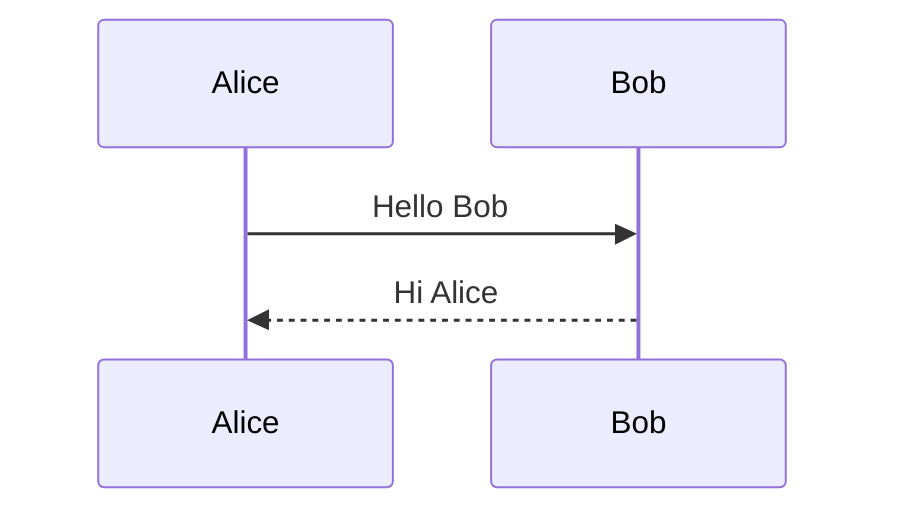

# Blog Posts Guide

This directory contains blog posts for the al-folio site. Posts are written in Markdown with YAML front matter.

## Creating a New Post

Create a file named `YYYY-MM-DD-title.md` (e.g., `2024-09-21-my-first-post.md`).

### Minimal Front Matter

```yaml
---
layout: post
title: Your Post Title
date: 2024-09-21 10:00:00
description: Brief description for previews
tags: tag1 tag2
categories: category-name
---
```

## Front Matter Options

### Core Settings

| Field         | Description                       | Example                      |
| ------------- | --------------------------------- | ---------------------------- |
| `layout`      | Page layout (`post` or `distill`) | `post`                       |
| `title`       | Post title                        | `"My Research Update"`       |
| `date`        | Publication date with timezone    | `2024-09-21 10:00:00-0400`   |
| `description` | Brief summary for previews        | `"A summary of recent work"` |
| `tags`        | Space-separated tags              | `formatting math code`       |
| `categories`  | Post categories                   | `research tutorials`         |
| `author`      | Override default author           | `"Guest Author"`             |

### Display & Navigation

| Field           | Description             | Values                  |
| --------------- | ----------------------- | ----------------------- |
| `featured`      | Highlight on blog page  | `true` / `false`        |
| `thumbnail`     | Preview image           | `assets/img/thumb.jpg`  |
| `related_posts` | Show related posts      | `true` / `false`        |
| `redirect`      | Redirect to another URL | `/assets/pdf/paper.pdf` |

### Table of Contents

```yaml
# TOC at beginning of post
toc:
  beginning: true

# TOC in sidebar
toc:
  sidebar: left   # or 'right'
```

### Comments (Giscus)

```yaml
giscus_comments: true
```

### Bibliography References

```yaml
related_publications: key1, key2 # References from papers.bib
```

### Custom Styles

```yaml
_styles: >
  .custom-class {
    color: blue;
  }
```

## Special Layouts

### Distill-Style Posts

For academic articles with citations, footnotes, and interactive elements:

```yaml
---
layout: distill
title: Academic Article Title
date: 2024-09-21
description: Research paper style post

authors:
  - name: Your Name
    url: "https://yoursite.com"
    affiliations:
      name: University Name

bibliography: 2024-09-21-paper.bib # Custom bib file in _bibliography/

toc:
  - name: Introduction
  - name: Methods
    subsections:
      - name: Data Collection
      - name: Analysis
  - name: Results
---
```

**Distill-specific features:**

- Use `<d-cite key="bibkey"></d-cite>` for inline citations
- Use `<d-footnote>Note text</d-footnote>` for footnotes
- Bibliography auto-generated from the specified `.bib` file

## Content Features

### Images

```liquid


<!-- Zoomable image -->

```

**Grid layout:**

```html
<div class="row mt-3">
  <div class="col-sm mt-3 mt-md-0">
    
  </div>
  <div class="col-sm mt-3 mt-md-0">
    
  </div>
</div>
<div class="caption">Caption text here</div>
```

### Videos

```liquid
<!-- Local video -->


<!-- YouTube embed -->


<!-- Vimeo embed -->

```

### Audio

```liquid

```

### Math (MathJax)

Inline: `$$ E = mc^2 $$` renders as inline math.

Display mode:

```
$$
\sum_{k=1}^\infty |\langle x, e_k \rangle|^2 \leq \|x\|^2
$$
```

Numbered equations:

```latex
\begin{equation}
\label{eq:example}
f(x) = ax^2 + bx + c
\end{equation}
```

Reference with `\eqref{eq:example}`.

### Code Blocks

````markdown
```python
def hello():
    print("Hello, world!")
```
````

**With line numbers:**

```liquid

def hello():
    print("Hello, world!")

```

### Diagrams (Mermaid)

Enable in front matter:

```yaml
mermaid:
  enabled: true
  zoomable: true
```

Then use:

````markdown

````

### TikZ Diagrams

Enable in front matter:

```yaml
tikzjax: true
```

Then use:

```html
<script type="text/tikz">
  \begin{tikzpicture}
      \draw[red] (0,0) circle [radius=1.5];
  \end{tikzpicture}
</script>
```

### Jupyter Notebooks

Place notebook in `assets/jupyter/` and include:

```liquid
{::nomarkdown}



    

    <p>Notebook not found.</p>

{:/nomarkdown}
```

### Custom Blockquotes

```markdown
> ##### TIP
>
> This is a tip blockquote.
> {: .block-tip }

> ##### WARNING
>
> This is a warning.
> {: .block-warning }

> ##### DANGER
>
> This is a danger notice.
> {: .block-danger }
```

## Site-Wide Blog Settings

In `_config.yml`:

```yaml
blog_name: My Blog
blog_description: A blog about research

# Tags/categories shown on blog page
display_tags: ["research", "tutorials", "news"]
display_categories: ["papers"]

# Related posts
related_blog_posts:
  enabled: true
  max_related: 5

# Pagination
pagination:
  enabled: true
```

## Drafts

Store unpublished posts in `_drafts/` directory (create if needed). These won't be built unless you run:

```bash
bundle exec jekyll serve --drafts
```

## Example Posts Reference

| Post                                      | Features Demonstrated                          |
| ----------------------------------------- | ---------------------------------------------- |
| `2015-03-15-formatting-and-links.md`      | Basic formatting, tags, categories             |
| `2015-05-15-images.md`                    | Image galleries, zoomable images, thumbnails   |
| `2015-07-15-code.md`                      | Code blocks, syntax highlighting, line numbers |
| `2015-10-20-math.md`                      | MathJax, equations                             |
| `2018-12-22-distill.md`                   | Distill layout, citations, footnotes, authors  |
| `2021-07-04-diagrams.md`                  | Mermaid diagrams                               |
| `2023-03-20-table-of-contents.md`         | TOC at beginning                               |
| `2023-04-25-sidebar-table-of-contents.md` | Sidebar TOC                                    |
| `2023-04-24-videos.md`                    | Video embeds                                   |
| `2023-04-25-audios.md`                    | Audio embeds                                   |
| `2023-05-12-custom-blockquotes.md`        | Styled blockquotes                             |
| `2023-07-04-jupyter-notebook.md`          | Jupyter notebooks                              |
| `2023-07-12-post-bibliography.md`         | Bibliography references                        |
| `2023-12-12-tikzjax.md`                   | TikZ diagrams                                  |
| `2022-02-01-redirect.md`                  | Page redirects                                 |
